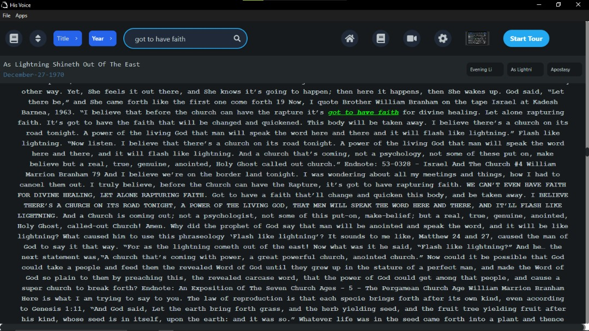
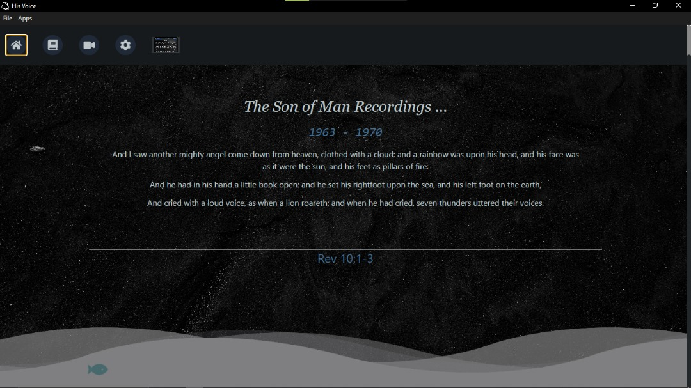
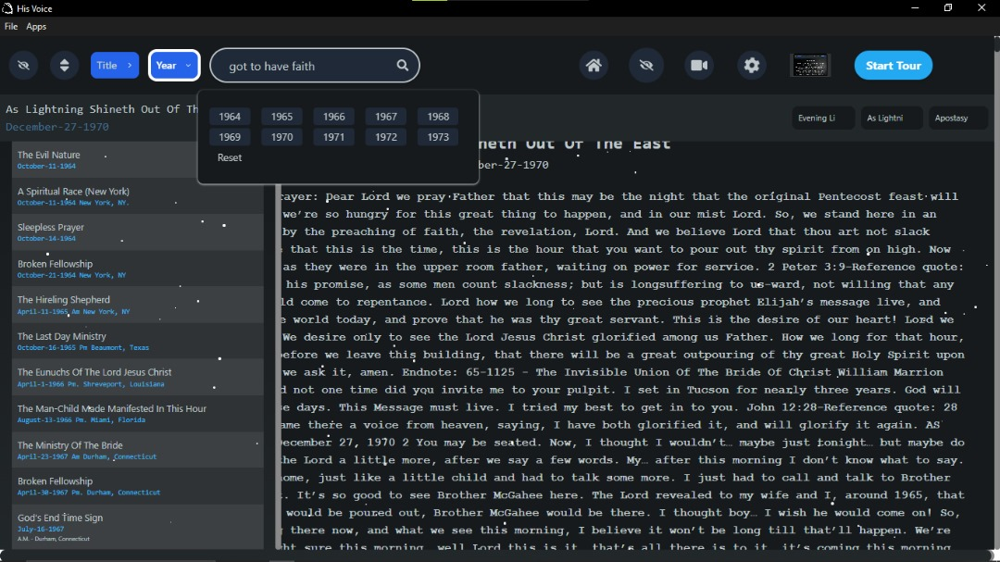
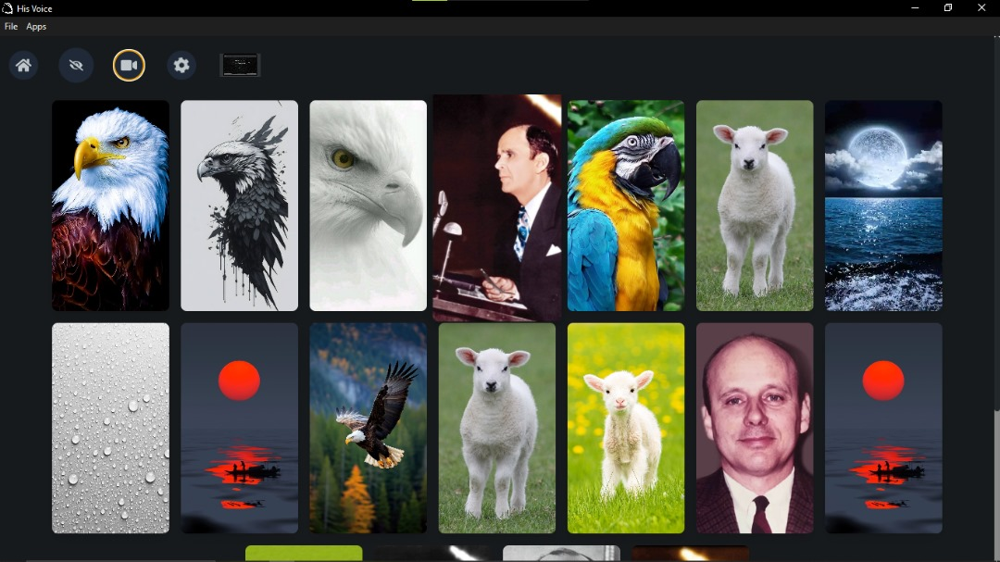

# Sermon Reader Application

The Sermon Reader Application is a desktop app built with Electron that allows users to read Bob Lambert's sermons offline. The app features a dynamic search functionality to easily find specific sermons and supports both text and audio formats.

## Features
- **Intuitive UI**: User-friendly interface for navigating and accessing sermons.
- **Cross-Platform**: Available on Windows(works best on windows)
- **Offline Support**: Access sermons without an internet connection.
- **Search Functionality**: Quickly search for specific sermons and quotes within sermons.
- **Audio Playback**: Listen to sermon audio files directly within the app.

## Download

Download the latest version from the [releases page](https://github.com/codeDeSyntax/Electron-React-App/releases).

## Installation

1. Download the installer for your platform from the [releases page](https://github.com/yourusername/your-repo-name/releases).
2. Run the installer and follow the on-screen instructions.
3. Launch the app and start reading or listening to sermons!

## Usage

- **Search**: Use the search bar to find specific sermons or quotes.
- **Read Sermons**: Browse and read sermons in text format.
- **Listen to Sermons**: Play sermon audio files from the app.

## Contributing

Contributions are welcome! Please read the [contributing guidelines](CONTRIBUTING.md) first.

## License

This project is licensed under the MIT License - see the [LICENSE](LICENSE) file for details.

## Contact

For any inquiries or issues, please open an issue on the [GitHub repository](https://github.com/codeDeSyntax/Electron-React-App/issues).

## Screenshots

 
 
 
 

